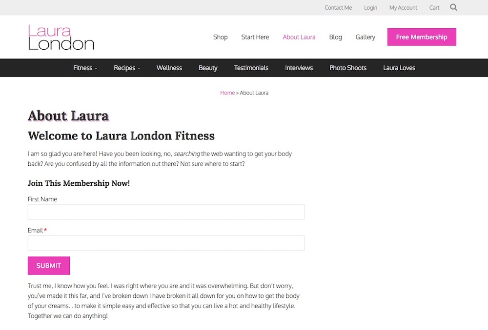

# Wampum User Forms
Create login, password, and free membership (w/ user registration) forms that use the WP-API form processing
* Use a simple shortcode (or PHP function) to create forms throughout your website
* Elegant error/success notices
* Membership form requires WooCommerce and WooCommerce Memberships and includes support for SharpSpring marketing automation
* Works well with Wampum Popups plugin
* Easy plugin updates in the WordPress Dashboard via [GitHub Updater plugin](https://github.com/afragen/github-updater)



##Basic Usage##

###Login Form###

Allows a logged out user to login.

####Shortcode####

**Default:**
```
[wampum_login_form]
```

**Custom:**
```
[wampum_login_form title="Login Now!" redirect="https://bizbudding.com"]
```

####PHP####

**Default:**
```
echo wampum_get_login_form();
```

**Custom:**
```
$args = array(
	'title'		=> 'Login Now',
	'redirect'	=> 'https://bizbudding.com/',
);
echo wampum_get_login_form( $args );
```

###Password Form###

Allows a logged in user to change their password.

####Shortcode####

**Default:**
```
[wampum_password_form]
```

**Custom:**
```
[wampum_password_form title="Set A New Password"]
```

####PHP###

**Default:**
```
echo wampum_get_password_form();
```

**Custom:**
```
$args = array(
	'title'		=> 'Change Your Password',
	'redirect'	=> 'https://bizbudding.com/',
);
echo wampum_get_password_form( $args );
```

###Membership Form###

Creates a clean and efficient onboarding flow for adding users to a membership.

####Shortcode####

```
[wampum_membership_form title="Join Now!" plan_id="26180" redirect="https://bizbudding.com/my-account/" ss_baseuri="https://app-3QMU9AFX44.marketingautomation.services/webforms/receivePostback/MzawMDE2MjCwAAA/" ss_endpoint="b19a2e43-3904-4b80-b587-353767f56849"]
```

####PHP####

```
$args = array(
	'plan_id'	=> '1234', // required
	'title'		=> 'Join This Membership!',
	'redirect'	=> 'https://bizbudding.com/',
);
echo wampum_get_membership_form( $args );
```

####Logged out users###

* If user tries to login with an existing username/email, they are asked to login first.
If they click the login link it displays the login form.
After successful login, the membership form is loaded and username/email is prefilled.
* After successful submission a user account is created and (if password fields were not used) the password form is loaded.
The user must change their password (password was auto-generated) then they are redirected.
* If SharpSpring parameters are used, the submission is sent to SS during processing.

####Logged in users####

* User fields are pre-filled, and username/email fields are readonly
* After submission, user is redirected

##Shortcode parameters & PHP args##

###Login Form###

####title####

(string) 'Login Now!'

**Default** `'Login'`

Change the heading of the form

---

####title_wrap####

(string) 'h4'

**Default** `'h3'`

Change title wrapping element

---

####button####

(string) 'Submit'

**Default** `'Log In'`

Submit button text

---

####redirect####

(string) 'https://bizbudding.com'

**Default** `{current page URL}`

Where to redirect after successful submission

---

####remember####

(boolean) true|false

**Default** `true`

Show the remember me checkbox

---

####value_username####

(string) 'https://bizbudding.com'

**Default** `{value to prefill for username}` This works better in PHP if you want to auto-fill something tricky

The value to auto-fill in the username field

---

####value_remember####

(boolean) true|false

**Default** `true`

Default "Remember Me" checked or unchecked

---

###Password Form###

####title####

(string) 'Change Your Password'

**Default** `'Set A New Password'`

Change the heading of the form

---

####title_wrap####

(string) 'h4'

**Default** `'h3'`

Change title wrapping element

---

####button####

(string) 'Submit'

**Default** `'Save Password'`

Submit button text

---

####redirect####

(string) 'https://bizbudding.com'

**Default** `{current page URL}`

Where to redirect after successful submission

---

###Membership Form###

####plan_id (**required**)####

(integer) 1234

**Default** `null`

Membership ID that this form will add the user to

---

####title####

(string) 'Join Now!'

**Default** `null`

Change the heading of the form

---

####title_wrap####

(string) 'h4'

**Default** `'h3'`

Change title wrapping element

---

####button####

(string) 'Join Now'

**Default** `'Submit'`

Submit button text

---

####redirect####

(string) 'https://bizbudding.com'

**Default** `{current page URL}`

Where to redirect after successful submission

---

####first_name####

(boolean) true|false

**Default** `true`

Show the first name field

---

####last_name####

(boolean) true|false

**Default** `false`

Show the last name field (non-required field)

---

####username####

(boolean) true|false

**Default** `false`

Show the username field (required field)

---

####password####

(boolean) true|false

**Default** `false`

Show the password field (required field)

---

####member_message####

(string) true|false

**Default** `{empty}`

Display a message in place of the form if a logged in user is already a member

---

####ss_baseuri####

(string) 'https://app-3QMU9AFX44.marketingautomation.services/webforms/receivePostback/MzawMDE2MjCwAAA/'

**Default** `{empty}`

The SharpSpring form base uri

In SharpSpring, get tracking code for a new "Native" form and use base uri from that code

---

####ss_endpoint####

(string) 'b19a2e43-3904-4b80-b587-353767f56849'

**Default** `{empty}`

The SharpSpring form endpoint

In SharpSpring, get tracking code for a new "Native" form and use endpoint from that code

---
